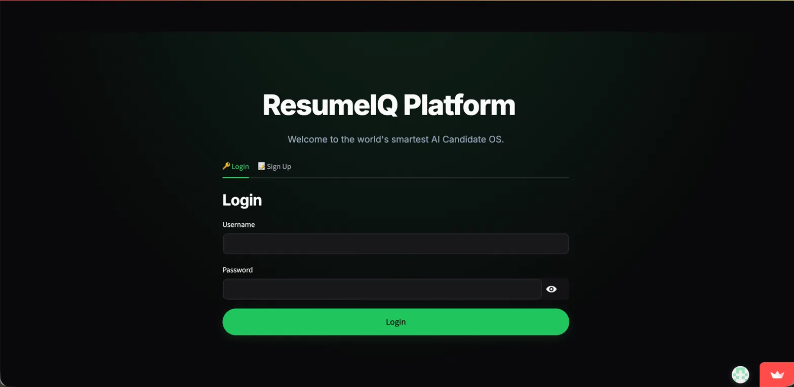

<div align="center">
  
  
  <br/>
  
  # 🚀 ResumeIQ 
  ### **AI-Powered ATS Optimizer, Resume Builder & Job Matcher**

  <p>
    
    
    
    
  </p>

  <p align="center">
    <strong>ResumeIQ</strong> is an enterprise-grade, glassmorphic web application designed to help job seekers instantly analyze their resumes, generate ATS-friendly PDFs, find matching jobs, and prepare for interviews using a custom suite of <strong>Machine Learning models</strong>.
  </p>
</div>

---

## ✨ Core Features

### 📊 1. Deep AI Resume Analysis
Upload your resume (PDF) and let our custom ML pipeline break it down.
*   **ATS Score & Grading**: Get a detailed breakdown of your formatting health, action verb count, and measurable metrics.
*   **Job Category Prediction**: Uses **Naive Bayes (MultinomialNB)** to automatically classify your resume into a specific industry domain.
*   **TF-IDF Market Gaps**: Compares your skills against an internal database of current job market requirements using **TF-IDF Vectorization** to highlight what you're missing.
*   **Bullet Point Inference**: Uses a lightweight integration with the Groq API (Llama-3) to grade your resume bullet points (Strong vs. Weak) and suggest actionable improvements.

<p align="center">
  
  
</p>

### ✍️ 2. Interactive Resume Editor & Live PDF Builder
Don't just analyze your resume—fix it in real-time!
*   **AI Structuring Engine**: Your uploaded PDF is cleanly parsed into structured fields (Experience, Education, Projects).
*   **Live PDF Preview**: Edit your details on the left, and instantly see a high-fidelity, ATS-friendly PDF compile on the right!
*   **Failsafe Formatting**: If the AI hits rate limits, the internal PDF Regex Engine automatically steps in to parse your raw text into perfect bullet points.

<p align="center">
  
</p>

### 💼 3. Smart Job Matching
Stop guessing what jobs you qualify for.
*   ResumeIQ scans an internal SQLite database of thousands of jobs.
*   It calculates an exact **Skill Overlap %** between your extracted skills and the job descriptions using **Cosine Similarity**.
*   Leverages **K-Nearest Neighbors (KNN)** to cluster and recommend the closest semantic job matches.

<p align="center">
  
  
</p>

### 🎯 4. Jobscan Matcher
Have a specific Job Description (JD) you want to apply for?
*   Paste the JD into the Jobscan tab.
*   Instantly see your match percentage, Keyword Matches, and Missing Keywords calculated directly via **TF-IDF Vectorization** and **Cosine Similarity**.

### 🎙️ 5. AI Interview Prep & Cover Letter Generator
Once you find a job, ResumeIQ helps you land it.
*   **Dynamic Interview Questions**: Generates 5-7 behavioral and technical interview questions based *specifically* on the weak points and skill gaps in your resume!
*   **1-Click Cover Letters**: Generates a tailored, professional Cover Letter PDF matching your exact resume template.

<p align="center">
  
  
</p>

### 📈 6. Analytics & Global Leaderboard
*   **Radar Charts**: Visualize your technical strengths against the market average.
*   **Leaderboard**: See how your ATS score stacks up against other candidates on the platform!

---

## 🛠️ Tech Stack & Architecture

*   **Frontend**: Streamlit + Custom Vanilla CSS (Premium Glassmorphic UI)
*   **Backend & Data Processing**: Python, Pandas, Numpy
*   **Core Machine Learning**: `scikit-learn` 
    *   *TF-IDF Vectorizer* (Text extraction & keyword mapping)
    *   *Cosine Similarity* (Job-to-Resume overlap matching)
    *   *K-Nearest Neighbors (KNN)* (Job recommendation clustering)
    *   *Naive Bayes (MultinomialNB)* (Industry domain prediction)
*   **Secondary LLM API**: Groq API (Used exclusively for dynamic Interview Question generation and Bullet Point grading).
*   **PDF Processing**: PyMuPDF (`fitz`), FPDF2, Playwright
*   **Database**: SQLite (`data/jobs.db`)

---

## 🚀 Getting Started

Follow these instructions to run ResumeIQ on your local machine.

### 1. Clone the Repository
```bash
git clone https://github.com/gitesh-goyal88/resume-scorer.git
cd resume-scorer
```

### 2. Install Dependencies
Ensure you have Python 3.9+ installed.
```bash
pip install -r requirements.txt
```

### 3. Setup Environment Variables
You need a free API key from [Groq](https://console.groq.com/keys) to power the AI engine. 

Create a file named `.env` in the root directory:
```env
GROQ_API_KEY=gsk_your_actual_api_key_here
SENDER_EMAIL=your_email@gmail.com
SENDER_PASSWORD=your_app_password
DB_PATH=data/jobs.db
```

### 4. Run the Application
```bash
streamlit run app.py
```
*The application will open automatically in your browser at `http://localhost:8501`.*

---

## 📸 Image Gallery

Explore more screenshots of the ResumeIQ interface!

<p align="center">
  
  
  
</p>
<p align="center">
  
  
  
</p>
<p align="center">
  
  
</p>

---

<div align="center">
  <i>Built with ❤️ for modern job seekers.</i>
</div>
